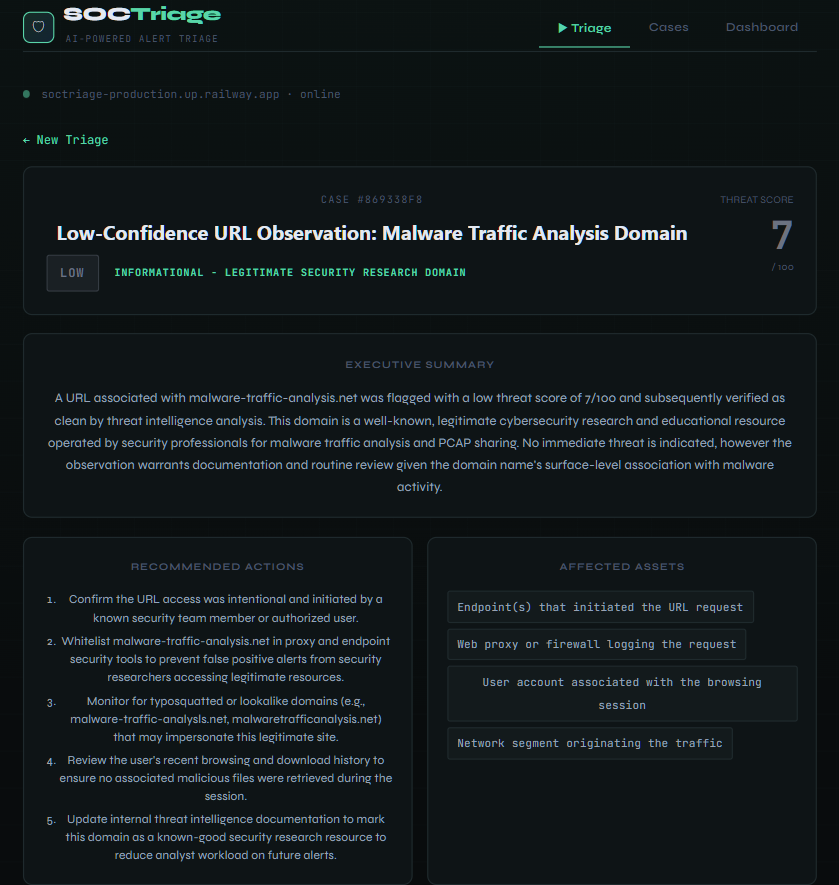
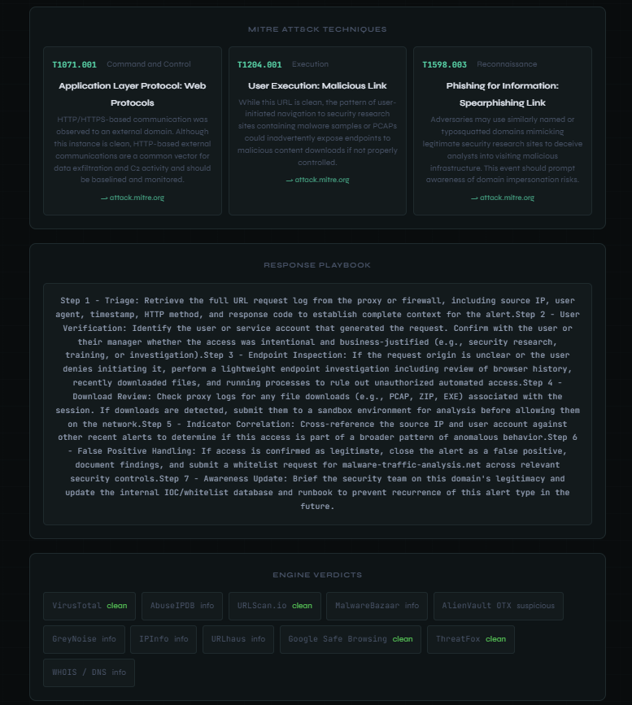

# SOCTriage

**AI-powered SOC alert triage assistant — free, open-source alternative to enterprise SOAR platforms.**

[](https://github.com/SalCyberAware/SOCTriage/actions/workflows/backend-tests.yml)
[](https://codecov.io/gh/SalCyberAware/SOCTriage)
[](https://soctriage.vercel.app)
[](https://soctriage-production.up.railway.app/health)
[](LICENSE)
[](https://python.org)

---

## What It Does

SOCTriage automates the first 30 minutes of SOC alert triage. Paste an IP, domain, URL, or file hash — SOCTriage enriches it across **11 threat intelligence engines** simultaneously and generates a full **AI-powered incident report** with MITRE ATT&CK mapping, severity scoring, recommended actions, and a step-by-step response playbook.

Enterprise SOAR platforms (Splunk SOAR, Palo Alto XSOAR) cost **$100,000+ per year**. SOCTriage is free.

<div align="center">





</div>

---

## Live Demo

**Frontend:** https://soctriage.vercel.app  
**Backend Health:** https://soctriage-production.up.railway.app/health

---

## Features

- **IOC Enrichment** — Queries 11 threat intelligence engines via [ThreatScan](https://github.com/SalCyberAware/ThreatScan) and returns aggregated verdicts and threat scores
- **AI Incident Reports** — Claude AI generates executive summaries, threat classifications, affected asset identification, and recommended actions
- **MITRE ATT&CK Mapping** — Every IOC is automatically mapped to relevant ATT&CK techniques and tactics with direct links to attack.mitre.org
- **Severity Scoring** — LOW / MEDIUM / HIGH / CRITICAL based on weighted engine results (0–100 scale)
- **Response Playbook** — Step-by-step containment, investigation, eradication, and recovery guidance tailored to the specific threat
- **Case Management** — Cases are opened automatically with full timeline logging; status can be updated (OPEN → IN_PROGRESS → ESCALATED → CLOSED)
- **Dashboard** — Live stats by case status and severity

---

## Tech Stack

| Layer | Technology |
|-------|-----------|
| Frontend | React + Vite → Vercel |
| Backend | Python FastAPI → Railway |
| AI Engine | Anthropic Claude API |
| Enrichment | ThreatScan API (11 engines) |
| Data Models | Pydantic v2 |

---

## Threat Intelligence Engines

SOCTriage enriches IOCs through ThreatScan, which queries:

1. VirusTotal
2. AbuseIPDB
3. URLScan.io
4. AlienVault OTX
5. GreyNoise
6. MalwareBazaar
7. URLhaus (abuse.ch)
8. ThreatFox
9. Google Safe Browsing
10. IPInfo
11. WHOIS / DNS

---

## How SOCTriage compares

SOCTriage is a fast first-pass triage layer: paste an IOC, get enriched intel from 11 sources, an AI-generated incident report mapped to MITRE ATT&CK, and a tracked case with timeline in under a minute. It is **not** a full SOAR platform — it's the layer that compresses the 15–30 minutes of manual tab-switching and report-writing that usually happens **before** a SOAR playbook fires (or in place of one, for teams without SOAR budget). Honest comparison:

| Tool | Category | Cost | Strengths | Where SOCTriage differs |
|------|----------|------|-----------|--------------------------|
| Cortex XSOAR / Splunk SOAR / Tines | Enterprise SOAR | ~$100k+/yr | Massive integration libraries, playbook automation across hundreds of tools, mature case management, SLA dashboards | SOCTriage is zero-install (one Vercel + one Railway deploy), free, and AI-first — no playbook authoring required. Meant to slot in **before** these for first-pass triage, not replace them |
| TheHive + Cortex | Open-source SOC platform | Free, self-hosted | Mature case management, observable enrichment via Cortex analyzers, MISP integration, active community | SOCTriage is hosted (no Elasticsearch/Cassandra ops burden); ships LLM-generated narrative reports + auto-derived ATT&CK techniques instead of raw analyzer output you compose yourself |
| Manual workflow (SIEM + tabs + ticketing) | What most small SOC teams actually do | "Free," burns analyst time | Full flexibility, familiar tools, no new platform to learn | SOCTriage compresses paste-IOC → 11-engine enrich → ATT&CK mapping → AI report → tracked case into one request; the manual equivalent is 15–30 min per alert across many tabs |

**A note on the AI-generated MITRE mapping:** technique IDs, tactics, and `attack.mitre.org` URLs are produced by Claude per-triage from the enriched intel and alert context, not from a static mapping table. That makes them context-aware (the same IOC in a different alert context can map to different techniques), but reviewers should sanity-check the techniques on high-stakes incidents the same way they would any LLM output.

**A note on the enrichment layer:** SOCTriage delegates the 11-engine fan-out to its sister project [ThreatScan](https://github.com/SalCyberAware/ThreatScan) via an HTTP call. The intel work isn't reinvented — SOCTriage adds the AI report, ATT&CK mapping, and case lifecycle on top.

### When to use what

- **Use enterprise SOAR (Cortex XSOAR, Splunk SOAR, Tines)** when you have a team of analysts, dozens of integrations to orchestrate, complex playbooks, and the budget for the licenses.
- **Use TheHive + Cortex** when you want full self-hosted control over case data, have the ops capacity to run Elasticsearch/Cassandra, and prefer composing analyzers yourself.
- **Use SOCTriage** when you're a small/mid SOC team that needs fast first-pass triage without enterprise overhead — especially for the AI-generated incident report and ATT&CK mapping out of the box.

---

## API Endpoints

```
POST   /api/triage              Submit IOC for enrichment + AI report + case creation
GET    /api/cases               List all cases
GET    /api/cases/{id}          Get single case with full timeline
PATCH  /api/cases/{id}/status   Update case status
PATCH  /api/cases/{id}/note     Add analyst note
PATCH  /api/cases/{id}/close    Close case with resolution
GET    /api/dashboard           Stats by status and severity
GET    /health                  Health check
```

### Example Request

```bash
curl -X POST https://soctriage-production.up.railway.app/api/triage \
  -H "Content-Type: application/json" \
  -d '{
    "ioc": "185.220.101.45",
    "ioc_type": "ip",
    "raw_alert": "CrowdStrike: suspicious outbound connection from WS-042 at 2:00 AM",
    "analyst_notes": "User reported no activity at that time"
  }'
```

### Example Response

```json
{
  "case_id": "4FA22FE3",
  "status": "success",
  "report": {
    "title": "Suspicious Outbound C2 Connection from WS-042 to Malicious IP 185.220.101.45",
    "severity": "high",
    "threat_type": "C2 (Command and Control)",
    "summary": "Workstation WS-042 initiated a suspicious outbound connection...",
    "mitre_techniques": [
      {
        "technique_id": "T1071.001",
        "technique_name": "Application Layer Protocol: Web Protocols",
        "tactic": "Command and Control",
        "mitre_url": "https://attack.mitre.org/techniques/T1071/001/"
      }
    ],
    "recommended_actions": [
      "Immediately isolate WS-042 from the network",
      "Block 185.220.101.45 at perimeter firewall",
      "Conduct full forensic image of WS-042"
    ],
    "playbook": [
      "STEP 1 - CONTAINMENT: Isolate WS-042 immediately via NAC or VLAN quarantine...",
      "STEP 2 - IDENTIFICATION: Pull CrowdStrike process tree and network telemetry..."
    ]
  },
  "enrichment": {
    "verdict": "malicious",
    "score": 83
  }
}
```

---

## Self-Hosting

### Prerequisites

- Python 3.11+
- Anthropic API key (console.anthropic.com)
- ThreatScan running locally or use the live instance

### Backend Setup

```bash
git clone https://github.com/SalCyberAware/SOCTriage.git
cd SOCTriage/backend
pip install -r requirements.txt

cp .env.example .env
# Edit .env with your API keys

uvicorn main:app --host 0.0.0.0 --port 8080 --reload
```

### Environment Variables

```env
ANTHROPIC_API_KEY=your_anthropic_api_key
THREATSCAN_API_URL=https://threatscan-production.up.railway.app/api
FRONTEND_URL=http://localhost:5173
ENV=development
PORT=8080
```

### Frontend Setup

```bash
cd SOCTriage/frontend
npm install

echo "VITE_API_URL=http://localhost:8080" > .env

npm run dev
```

---

## Project Structure

```
SOCTriage/
├── backend/
│   ├── main.py              # FastAPI app, CORS, route registration
│   ├── models.py            # Pydantic data models
│   ├── requirements.txt
│   ├── Procfile             # Railway start command
│   ├── runtime.txt          # Python 3.11.9
│   ├── routes/
│   │   └── triage.py        # API endpoints
│   └── services/
│       ├── enrichment.py    # ThreatScan integration
│       ├── ai_engine.py     # Claude AI report generation
│       └── case_manager.py  # In-memory case store + timeline
└── frontend/
    └── src/
        └── App.jsx          # React UI (single file)
```

---

## Roadmap

**Phase 2 — Enterprise Foundation**
- [ ] PostgreSQL database (replace in-memory store)
- [ ] Full case management UI with investigation timeline
- [ ] Evidence upload and attachment
- [ ] PDF export of incident reports
- [ ] Dashboard with charts

**Phase 3 — Enterprise Ready**
- [ ] JWT authentication (multi-analyst support)
- [ ] SIEM webhook integration
- [ ] Splunk integration
- [ ] Jira / ServiceNow ticket creation

---

## Author

**Salah-Adin Mozeb**  
CompTIA Security+ | Network+ | A+ | Cisco CCNA  
M.S. Cybersecurity — Georgia Tech (in progress)  
GitHub: [@SalCyberAware](https://github.com/SalCyberAware)

---

## License

MIT — free to use, modify, and distribute.

---

_Status (May 2026): backend is PostgreSQL-backed with a 71-test pytest suite running on GitHub Actions CI. Frontend auto-deploys to Vercel._
