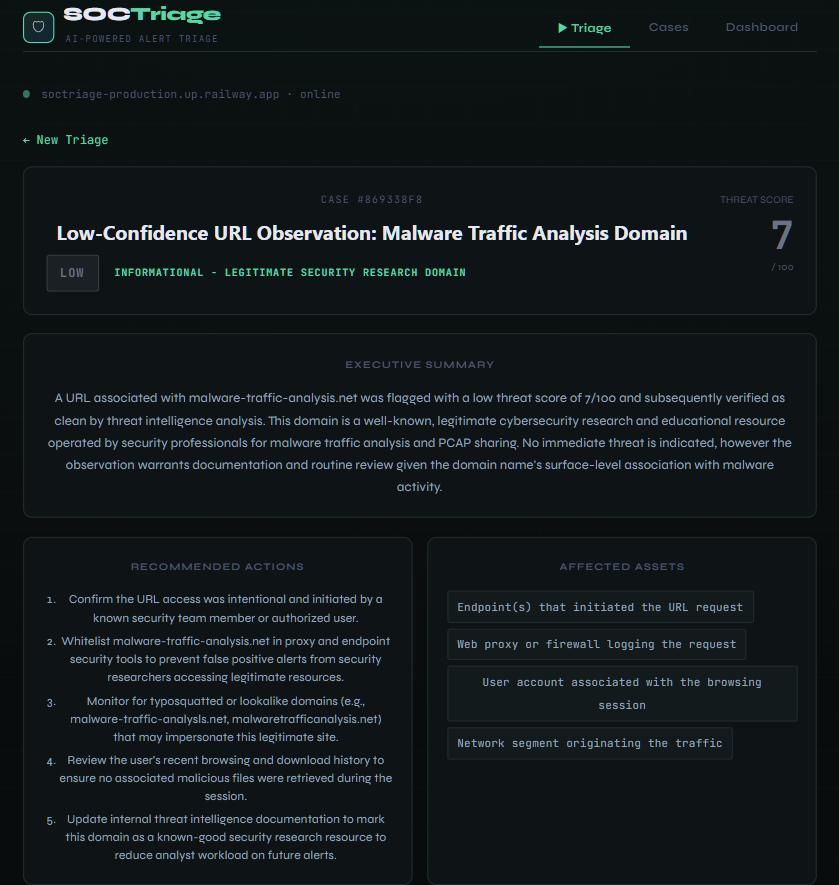
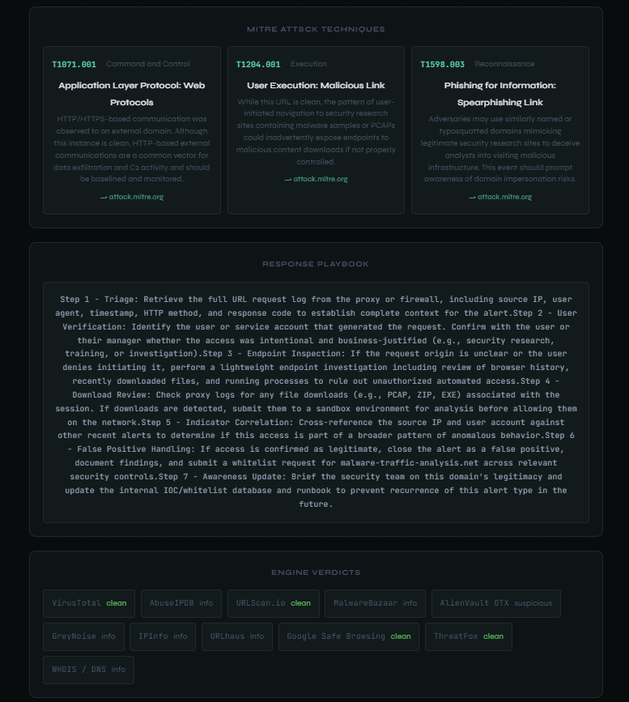

# SOCTriage

**AI-powered SOC alert triage assistant — free, open-source alternative to enterprise SOAR platforms.**

[](https://github.com/SalCyberAware/SOCTriage/actions/workflows/backend-tests.yml)
[](https://codecov.io/gh/SalCyberAware/SOCTriage)
[](https://soctriage.vercel.app)
[](https://soctriage-production.up.railway.app/health)
[](LICENSE)
[](https://python.org)

---

## What It Does

SOCTriage automates the first 30 minutes of SOC alert triage. Paste an IP, domain, URL, or file hash — SOCTriage enriches it across **11 threat intelligence engines** simultaneously and generates a full **AI-powered incident report** with MITRE ATT&CK mapping, severity scoring, recommended actions, and a step-by-step response playbook.

Enterprise SOAR platforms (Splunk SOAR, Palo Alto XSOAR) cost **$100,000+ per year**. SOCTriage is free.

<div align="center">





</div>

---

## Live Demo

**Frontend:** https://soctriage.vercel.app  
**Backend Health:** https://soctriage-production.up.railway.app/health

---

## Features

- **IOC Enrichment** — Queries 11 threat intelligence engines via [ThreatScan](https://github.com/SalCyberAware/ThreatScan) and returns aggregated verdicts and threat scores
- **AI Incident Reports** — Claude AI generates executive summaries, threat classifications, affected asset identification, and recommended actions
- **MITRE ATT&CK Mapping** — Every IOC is automatically mapped to relevant ATT&CK techniques and tactics with direct links to attack.mitre.org
- **Severity Scoring** — LOW / MEDIUM / HIGH / CRITICAL based on weighted engine results (0–100 scale)
- **Response Playbook** — Step-by-step containment, investigation, eradication, and recovery guidance tailored to the specific threat
- **Case Management** — Cases are opened automatically with full timeline logging; status can be updated (OPEN → IN_PROGRESS → ESCALATED → CLOSED)
- **Dashboard** — Live stats by case status and severity

---

## Tech Stack

| Layer | Technology |
|-------|-----------|
| Frontend | React + Vite → Vercel |
| Backend | Python FastAPI → Railway |
| AI Engine | Anthropic Claude API |
| Enrichment | ThreatScan API (11 engines) |
| Data Models | Pydantic v2 |

---

## Threat Intelligence Engines

SOCTriage enriches IOCs through ThreatScan, which queries:

1. VirusTotal
2. AbuseIPDB
3. URLScan.io
4. AlienVault OTX
5. GreyNoise
6. MalwareBazaar
7. URLhaus (abuse.ch)
8. ThreatFox
9. Google Safe Browsing
10. IPInfo
11. WHOIS / DNS

---

## How SOCTriage compares

SOCTriage is a fast first-pass triage layer: paste an IOC, get enriched intel from 11 sources, an AI-generated incident report mapped to MITRE ATT&CK, and a tracked case with timeline in under a minute. It is **not** a full SOAR platform — it's the layer that compresses the 15–30 minutes of manual tab-switching and report-writing that usually happens **before** a SOAR playbook fires (or in place of one, for teams without SOAR budget). Honest comparison:

| Tool | Category | Cost | Strengths | Where SOCTriage differs |
|------|----------|------|-----------|--------------------------|
| Cortex XSOAR / Splunk SOAR / Tines | Enterprise SOAR | ~$100k+/yr | Massive integration libraries, playbook automation across hundreds of tools, mature case management, SLA dashboards | SOCTriage is zero-install (one Vercel + one Railway deploy), free, and AI-first — no playbook authoring required. Meant to slot in **before** these for first-pass triage, not replace them |
| TheHive + Cortex | Open-source SOC platform | Free, self-hosted | Mature case management, observable enrichment via Cortex analyzers, MISP integration, active community | SOCTriage is hosted (no Elasticsearch/Cassandra ops burden); ships LLM-generated narrative reports + auto-derived ATT&CK techniques instead of raw analyzer output you compose yourself |
| Manual workflow (SIEM + tabs + ticketing) | What most small SOC teams actually do | "Free," burns analyst time | Full flexibility, familiar tools, no new platform to learn | SOCTriage compresses paste-IOC → 11-engine enrich → ATT&CK mapping → AI report → tracked case into one request; the manual equivalent is 15–30 min per alert across many tabs |

**A note on the AI-generated MITRE mapping:** technique IDs, tactics, and `attack.mitre.org` URLs are produced by Claude per-triage from the enriched intel and alert context, not from a static mapping table. That makes them context-aware (the same IOC in a different alert context can map to different techniques), but reviewers should sanity-check the techniques on high-stakes incidents the same way they would any LLM output.

**A note on the enrichment layer:** SOCTriage delegates the 11-engine fan-out to its sister project [ThreatScan](https://github.com/SalCyberAware/ThreatScan) via an HTTP call. The intel work isn't reinvented — SOCTriage adds the AI report, ATT&CK mapping, and case lifecycle on top.

### When to use what

- **Use enterprise SOAR (Cortex XSOAR, Splunk SOAR, Tines)** when you have a team of analysts, dozens of integrations to orchestrate, complex playbooks, and the budget for the licenses.
- **Use TheHive + Cortex** when you want full self-hosted control over case data, have the ops capacity to run Elasticsearch/Cassandra, and prefer composing analyzers yourself.
- **Use SOCTriage** when you're a small/mid SOC team that needs fast first-pass triage without enterprise overhead — especially for the AI-generated incident report and ATT&CK mapping out of the box.

---

## API Endpoints

```
POST   /api/triage              Submit IOC for enrichment + AI report + case creation
GET    /api/cases               List all cases
GET    /api/cases/{id}          Get single case with full timeline
PATCH  /api/cases/{id}/status   Update case status                 [API key]
PATCH  /api/cases/{id}/note     Add analyst note                   [API key]
PATCH  /api/cases/{id}/close    Close case with resolution         [API key]
GET    /api/dashboard           Stats by status and severity
GET    /health                  Health check
```

`[API key]` marks the routes that require authentication — see
[Authentication](#authentication) below. Everything else is open.

### Example Request

```bash
curl -X POST https://soctriage-production.up.railway.app/api/triage \
  -H "Content-Type: application/json" \
  -d '{
    "ioc": "185.220.101.45",
    "ioc_type": "ip",
    "raw_alert": "CrowdStrike: suspicious outbound connection from WS-042 at 2:00 AM",
    "analyst_notes": "User reported no activity at that time"
  }'
```

### Example Response

```json
{
  "case_id": "4FA22FE3",
  "status": "success",
  "report": {
    "title": "Suspicious Outbound C2 Connection from WS-042 to Malicious IP 185.220.101.45",
    "severity": "high",
    "threat_type": "C2 (Command and Control)",
    "summary": "Workstation WS-042 initiated a suspicious outbound connection...",
    "mitre_techniques": [
      {
        "technique_id": "T1071.001",
        "technique_name": "Application Layer Protocol: Web Protocols",
        "tactic": "Command and Control",
        "mitre_url": "https://attack.mitre.org/techniques/T1071/001/"
      }
    ],
    "recommended_actions": [
      "Immediately isolate WS-042 from the network",
      "Block 185.220.101.45 at perimeter firewall",
      "Conduct full forensic image of WS-042"
    ],
    "playbook": [
      "STEP 1 - CONTAINMENT: Isolate WS-042 immediately via NAC or VLAN quarantine...",
      "STEP 2 - IDENTIFICATION: Pull CrowdStrike process tree and network telemetry..."
    ]
  },
  "enrichment": {
    "verdict": "malicious",
    "score": 83
  }
}
```

---

## Authentication

The three routes that **modify an existing case** require an API key. Everything
else — `POST /api/triage`, all three reads, and `/health` — is open.

| Endpoint | Key required? | Why |
|----------|---------------|-----|
| `POST /api/triage` | No | It's the public demo. Its cost is already bounded by the [abuse controls](backend/limits.py): a per-IP rate limit and a global daily cap on the one endpoint that spends Anthropic and ThreatScan quota. A key here would close the demo and close nothing else. |
| `GET /api/cases`, `GET /api/cases/{id}`, `GET /api/dashboard` | No | Reads. They touch nothing but the local database and cost nothing per call. |
| `PATCH /api/cases/{id}/status`, `/note`, `/close` | **Yes** | They mutate somebody else's investigation record. A case id is eight hex characters — guessable enough that "you need the id" is not a control. |
| `GET /health` | No | Uptime monitoring. |

### Using a key

Send it in the `X-API-Key` header:

```bash
curl -X PATCH https://soctriage-production.up.railway.app/api/cases/4FA22FE3/status \
  -H "Content-Type: application/json" \
  -H "X-API-Key: $SOCTRIAGE_API_KEY" \
  -d '{"status": "in_progress"}'
```

A missing or wrong key returns `401` with a plain `detail` message and changes
nothing. The check runs **before** the case lookup, so an unauthenticated
caller gets the same 401 for a case id that exists and one that does not — the
routes are not an oracle for enumerating case ids. It also runs before the rate
limiter, so a refused request does not eat into anyone's allowance.

### Configuring keys

Set `SOCTRIAGE_API_KEYS` on the backend to one key, or to several separated by
commas. Several exist so a key can be rotated with no window where none works:
add the new one, move clients across, drop the old one.

```bash
# generate something worth having
python -c "import secrets; print(secrets.token_urlsafe(32))"
```

Keys are compared with `hmac.compare_digest`, not `==`. String equality returns
as soon as two bytes differ, which leaks the length of the matching prefix
through response timing; over enough samples that recovers a key one byte at a
time. The comparison loop also does not stop at the first matching key, so the
response time does not depend on which key was used.

### It fails closed

**With `SOCTRIAGE_API_KEYS` unset, the three PATCH routes return `401` to
everyone.** They do not fall back to accepting unauthenticated writes.

That is the inconvenient choice and it is deliberate. An auth check that
disappears along with its configuration is not a control, because the case it
has to survive is precisely a missing variable: a service moved between Railway
projects, a variable dropped in a redeploy, `SOCTRIAGE_API_KEY` typed for
`SOCTRIAGE_API_KEYS`. Fail-open turns every one of those into a silently
world-writable API that still returns 200 and still looks healthy — the same
shape of failure as the stale deploy that
[deploy verification](.github/workflows/deploy-verify.yml) exists to catch,
where every signal was green and the thing itself was broken. Fail-closed turns
them into a 401 on the first write, which is loud, immediate, and honest.

The cost is bounded and recoverable: a fresh clone cannot PATCH until it sets
the variable, and the 401 body says exactly that. Nothing that makes the demo
work is affected either way.

### The frontend and the hosted demo

[soctriage.vercel.app](https://soctriage.vercel.app) ships **no API key**. A
browser bundle cannot hold a secret — whatever is compiled into it is inlined
at build time and readable by anyone who opens devtools — so the demo does not
pretend to have one.

The Cases tab reflects that honestly. With no key configured, the expanded case
shows a short note in place of the status buttons, linking back to this
section, rather than offering a button that can only ever return 401:

> Changing a case requires an API key, and this build has none — the case below
> is read-only. [How authentication works](#authentication)

**Everything else on the tab is unchanged**: the case list, the AI summary, the
MITRE techniques, the full timeline, plus triage and the dashboard. Only the
one write control goes away.

### Giving the frontend a key

Set `VITE_API_KEY` at build time and the status buttons come back, sending the
key in `X-API-Key`:

```bash
echo "VITE_API_KEY=your_key" >> frontend/.env
```

Do this **only where the bundle itself is not public** — an internal
deployment, a build behind SSO — and treat the value as disclosed regardless,
because it is. A value that is empty or only whitespace counts as no key.

For a public deployment, the options that actually keep a key secret are to
drive the write endpoints from `curl` or a script, or to put a thin server-side
proxy in front that holds the key and is itself rate-limited.

---

## Audit Logging

Every write records who did what. All four of them, including the
unauthenticated `POST /api/triage` -- "an anonymous caller from 203.0.113.7
opened case 4FA22FE3" is exactly the kind of thing the trail exists to answer.

One JSON object per line on stdout, at INFO:

```json
{"ts":"2026-09-19T12:34:56.789012+00:00","event":"write","endpoint":"PATCH /api/cases/{case_id}/status","case_id":"4FA22FE3","ip":"203.0.113.7","authenticated":true}
```

| Field | Meaning |
|-------|---------|
| `ts` | ISO 8601 instant, UTC |
| `event` | Always `write` |
| `endpoint` | The route template, not the concrete path, so entries group cleanly |
| `case_id` | The case written. For `POST /api/triage`, the case it just opened |
| `ip` | The client behind the proxy: leftmost `X-Forwarded-For`, else the socket peer |
| `authenticated` | Whether the caller presented a valid API key |

Entries are written **after** the write succeeds, so the trail is of changes
that happened, not requests that were made: a 401, a 429, a 404 and every read
record nothing at all.

### What is never logged

No key material, and no free text -- not `raw_alert`, not analyst notes, not
note bodies, not resolution text. The entry records **that** a change happened;
**what** it said belongs to the case timeline, which is already persisted and
already served by `GET /api/cases/{id}`.

That is structural rather than a matter of care: `audit.build_entry` has no
parameter such a string could arrive through, and a test asserts the emitted
keys are exactly the six above.

### Why logs and not a database table

An `audit_events` table next to `cases` was the obvious alternative. Three
reasons against it here:

1. **The database already records what changed.** Every one of these writes
   appends a case timeline event that persists with the case. A table would
   re-record the same facts a second time, and two stores meant to agree about
   the same events eventually disagree about them.
2. **What the trail adds is the operational half -- client IP and whether the
   caller was authenticated -- and that half must not go in the cases table.**
   The timeline is served verbatim by an open endpoint. Putting a client IP
   there publishes it: a privacy leak introduced by the feature meant to
   improve accountability.
3. **A table nobody can read is not an audit trail.** Making it useful means a
   query endpoint, which needs its own authorization and a retention policy for
   the addresses it stores. Railway already captures stdout, with search and
   retention handled by the platform, for no new surface area.

The trade accepted along with that: retention is the platform's, not ours (a
few days on Railway's smaller plans), and the trail cannot be joined to the
cases table in SQL. If it ever needs to outlive the platform's window, the
upgrade is to ship these lines to a log store -- the shape of the record does
not change either way.

Read them with `railway logs`, or filter to the trail alone:

```bash
railway logs | grep '"event":"write"'
```

No configuration: there is nothing to set, and nothing to turn off.

---

## Self-Hosting

### Prerequisites

- Python 3.11+
- Anthropic API key (console.anthropic.com)
- ThreatScan running locally or use the live instance

### Backend Setup

```bash
git clone https://github.com/SalCyberAware/SOCTriage.git
cd SOCTriage/backend
pip install -r requirements.txt

cp .env.example .env
# Edit .env with your API keys

uvicorn main:app --host 0.0.0.0 --port 8080 --reload
```

### Environment Variables

```env
ANTHROPIC_API_KEY=your_anthropic_api_key
THREATSCAN_API_URL=https://threatscan-production.up.railway.app/api
FRONTEND_URL=http://localhost:5173
ENV=development
PORT=8080

# Required for the three PATCH routes; they return 401 without it.
# Comma-separate several values to rotate keys. See "Authentication" above.
SOCTRIAGE_API_KEYS=generate_one_with_secrets.token_urlsafe
```

The abuse-control variables (`SOCTRIAGE_IP_RATE`, `SOCTRIAGE_DAILY_TRIAGE_CAP`
and the length caps) are all optional and documented in
[`backend/.env.example`](backend/.env.example).

### Frontend Setup

```bash
cd SOCTriage/frontend
npm install

echo "VITE_API_URL=http://localhost:8080" > .env

# Optional: enables the Cases tab status buttons. Read the warning in
# "Giving the frontend a key" above before setting this on a public build.
echo "VITE_API_KEY=the_same_value_as_SOCTRIAGE_API_KEYS" >> .env

npm run dev
```

---

## Project Structure

```
SOCTriage/
├── backend/
│   ├── main.py              # FastAPI app, CORS, route registration
│   ├── auth.py              # API key gate on the write endpoints
│   ├── audit.py             # Structured audit trail for every write
│   ├── limits.py            # Rate limits, daily cap, length caps
│   ├── models.py            # Pydantic data models
│   ├── requirements.txt
│   ├── Procfile             # Railway start command
│   ├── runtime.txt          # Python 3.11.9
│   ├── routes/
│   │   └── triage.py        # API endpoints
│   └── services/
│       ├── enrichment.py    # ThreatScan integration
│       ├── ai_engine.py     # Claude AI report generation
│       └── case_manager.py  # In-memory case store + timeline
└── frontend/
    └── src/
        └── App.jsx          # React UI (single file)
```

---

## Roadmap

**Phase 2 — Enterprise Foundation**
- [ ] PostgreSQL database (replace in-memory store)
- [ ] Full case management UI with investigation timeline
- [ ] Evidence upload and attachment
- [ ] PDF export of incident reports
- [ ] Dashboard with charts

**Phase 3 — Enterprise Ready**
- [ ] JWT authentication (multi-analyst support)
- [ ] SIEM webhook integration
- [ ] Splunk integration
- [ ] Jira / ServiceNow ticket creation

---

## Author

**Salah-Adin Mozeb**  
CompTIA Security+ | Network+ | A+ | Cisco CCNA  
M.S. Cybersecurity — Georgia Tech (in progress)  
GitHub: [@SalCyberAware](https://github.com/SalCyberAware)

---

## License

MIT — free to use, modify, and distribute.

---

_Status (September 2026): backend is PostgreSQL-backed with a 230-test pytest suite, plus ruff and mypy, running on GitHub Actions CI. Write endpoints are API-key authenticated and audit-logged. Frontend auto-deploys to Vercel, and every push is checked to confirm both surfaces are actually serving the pushed commit._
